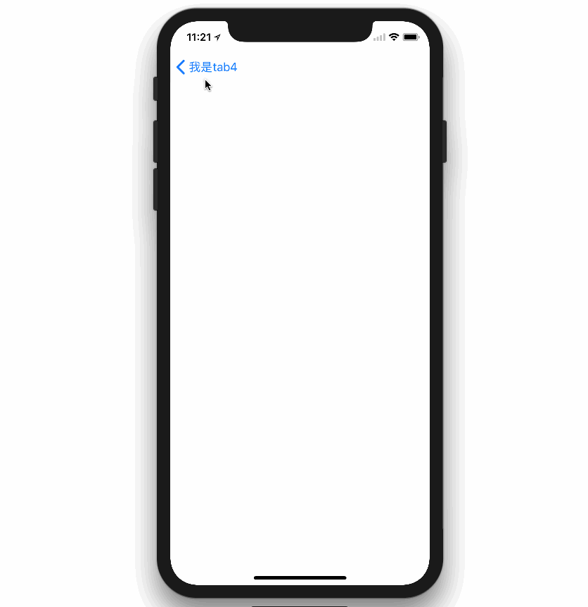

# ZTTabBarController

[](Screenshots/iphone.png)


* Supports iPad and iPhone
* Supports iphone X 
* Supports landscape and portrait orientations
* Can be used inside UINavigationController


##TODO
* Support the dynamic and static images of the selected and normal state
* Irregular Item

## Installation

### CocoaPods

If you're using [CocoaPods](http://www.cocoapods.org), simply add `pod 'ZTTabBarController'` to your Podfile.

### Drag & Drop

Add the items from `ZTTabBarController` directory to your project. If you don't have ARC enabled, you will need to set a `-fobjc-arc` compiler flag on the `.m` source files.

## Example Usage

#### Initialize ZTTabBarController

The initialization is simple,just insert code below

```objective-c
ZTTabbarItemAttribute * attribute = [ZTTabbarItemAttribute defaultAttribute];
ZTTabbarController * tabbarController  = [ZTTabbarController tabbarWithItemModels:[self models] ItemAppearce:attribute];
[tabbarController setChildViewControllers:[self viewControllers]];
tabbarController.delegate = self;
tabbarController.rectEdge = UIRectEdgeNone;
self.window.rootViewController = tabbarController;


- (NSArray <ZTTabbarItemModel *> *)models {
    ZTTabbarItemModel * model1 = [[ZTTabbarItemModel alloc]initWithNormalImageName:@"1_normal" andSelectImageName:@"1_select" andTitle:@"测试标题1"];
    ZTTabbarItemModel * model2 = [[ZTTabbarItemModel alloc]initWithNormalImageName:@"2_normal" andSelectImageName:@"2_select" andTitle:@"测试标题2"];
    ZTTabbarItemModel * model3 = [[ZTTabbarItemModel alloc]initWithNormalImageName:@"3_normal" andSelectImageName:@"3_select" andTitle:@"测试标题3"];
    ZTTabbarItemModel * model4 = [[ZTTabbarItemModel alloc]initWithNormalImageName:@"4_normal" andSelectImageName:@"4_select" andTitle:@"测试标题4"];
    return @[model1,model2,model3,model4];
}

- (NSArray <UIViewController *>*)viewControllers {
    return @[[self navcWithVC:[ViewController1 new]],[self navcWithVC:[ViewController2 new]],[self navcWithVC:[ViewController3 new]],[self navcWithVC:[ViewController4 new]]];
}


- (UINavigationController *)navcWithVC:(UIViewController *)vc {
    return [[UINavigationController alloc]initWithRootViewController:vc];
}

```

##### For ZTTabbarItemAttribute
this class is design to change item behavior by user 

```objective-c
@property (strong, nonatomic) UIColor *itemTitleColor;
@property (strong, nonatomic) UIColor *itemTitleSelectColor;
@property (strong, nonatomic) UIFont  *itemTitleFont;
@property (strong, nonatomic) UIColor *itemBgColor;
@property (strong, nonatomic) UIColor *itemBgSelectColor;
@property (assign, nonatomic) CGSize   itemImgSize;
```

#### ZTTabbarControllerDelegate
```objective-c
- (void)ZTTabbarController:(ZTTabbarController *)tabbarController willChangeSelectIndex:(NSInteger)selectIndex;
- (void)ZTTabbarController:(ZTTabbarController *)tabbarController didChangeSelectIndex:(NSInteger)selectIndex;
- (BOOL)ZTTabbarController:(ZTTabbarController *)tabbarController shouldChangeSelectIndex:(NSInteger)selectIndex;

```

#### For more usage of ZTTabbarController, see demo in the project 

## Requirements

* ARC
* iOS 8.0 or later
* Xcode 7

## Contact

[Seventeen-17](http://weibo.com/seventeen1717171717)   

## License

ZTTabBarController is available under the MIT license. See the LICENSE file for more info.
